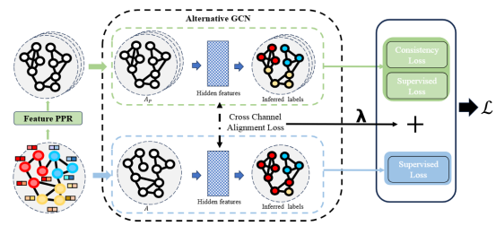

# PD2G
This is the source code of "Dual Channel Graph Convolutional Networks via Personalized PageRank".



## Requirements
This code requires the following:
* Python==3.9
* Pytorch==1.12.1
* Pytorch Geometric==2.3.0
* DGL==1.1.2
* For other libraries, refer to the requirements.txt file
## Construct feature graph
Construct feature graph for dataset for subsequent training. After the feature graph is constructed, it will be loaded automatically in subsequent training
```
python constructfeaturegraph.py

```
## Run
All datasets can be found in DGL or pyg open source framework for automatic download.\
Here we take Cora data as an example to show how to run
```
python main.py --dataset cora --T 20 --alpha 0.01 --hidden 256 --lambda_pa 0.7 --lambda_ce_aug 0.1 --lambda_consis 1.5 --num_neighbor 15 --missing_link 0 --missing_feature -1 --train_per_class 5

```
